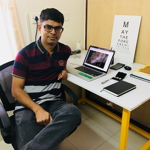

**electronut** is a culmination of my interests in programming and embedded systems. I started writing about my experiments with embedded hardware in 2010,
and in 2015, No Starch Press published my book *Python Playground*.

From 2016 to 2019 I ran a small consulting firm called Electronut Labs. In three years we built some interesting open source hardware, and custom devices 
for a number of clients. It was an exhilarating ride!

These days I spend time consulting on computer graphics (C++/OpenGL) and Embedded Systems, and writing technical books.

You can find me on Twitter at [@mkvenkit][1] and [@electronutlabs][2]. 

**Mahesh Venkitachalam**

(23 April 2021)

[1]: https://twitter.com/mkvenkit
[2]: https://twitter.com/electronutLabs
