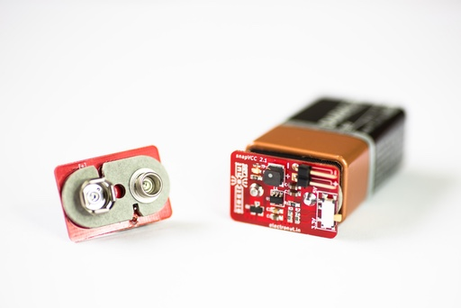
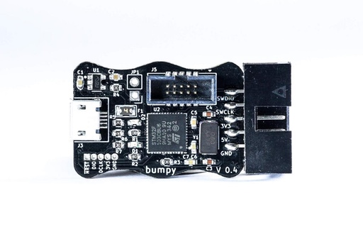

Here's some of the hardware designed by Electronut Labs.

# SnapVCC

snapVCC is a highly portable and convenient power supply for your electronics projects. It’s designed to snap right on to a 9 V battery and give you 3.3 V or 5 V power wherever you need it.

More information here: [https://gitlab.com/electronutlabs-public/ElectronutLabs-snapVCC](https://gitlab.com/electronutlabs-public/ElectronutLabs-snapVCC)

# Bluey

# iCE Bling

# PogoProg

# HackaBLE

# Bumpy 

Bumpy is an inexpensive Open Source blackmagic probe compatible SWD debugger designed to be used with ARM GDB. It supports many platforms, but was primarily designed for use with our Nordic Semiconductor nRF BLE boards.

More information here: [https://github.com/electronut/ElectronutLabs-Bumpy](https://github.com/electronut/ElectronutLabs-Bumpy)

# Papyr 

# Blip 

# Indrium Pi HAT

