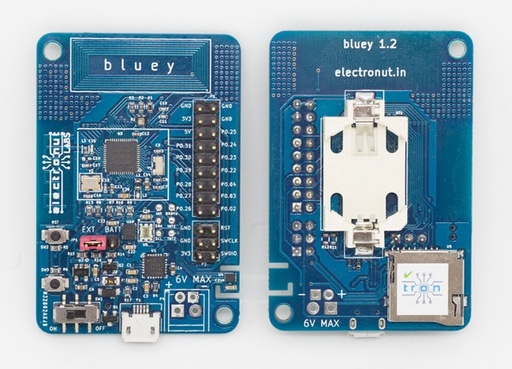
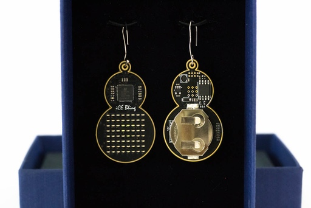
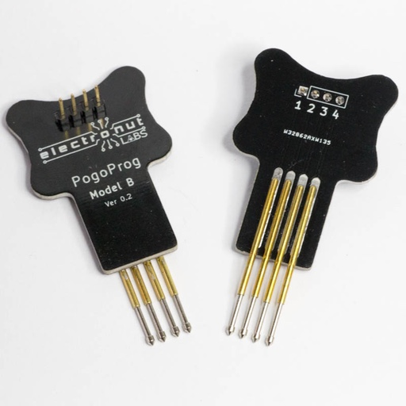
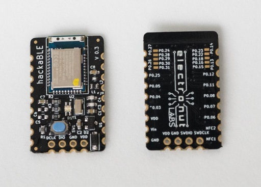
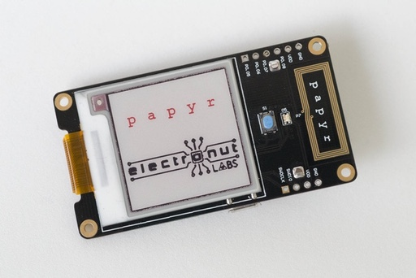
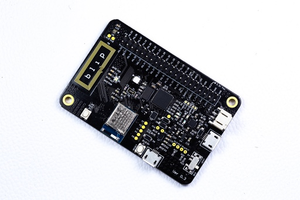
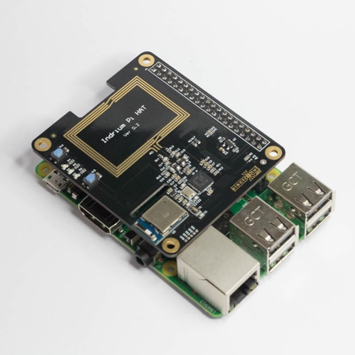

Here's some of the hardware designed by Electronut Labs. Some of this hardware is available for purchase at our [Tindie Store](https://www.tindie.com/stores/electronutlabs).

# SnapVCC

snapVCC is a highly portable and convenient power supply for your electronics projects. It’s designed to snap right on to a 9 V battery and give you 3.3 V or 5 V power wherever you need it.

More information here: [https://gitlab.com/electronutlabs-public/ElectronutLabs-snapVCC](https://gitlab.com/electronutlabs-public/ElectronutLabs-snapVCC)

# Bluey

Bluey is an Open Source BLE (Bluetooth Low Energy) development board with Temperature, Humidity, Ambient Light and Accelerometer sensors.

More information here: [https://github.com/electronut/ElectronutLabs-bluey](https://github.com/electronut/ElectronutLabs-bluey)

# iCE Bling

iCE Bling is an Lattice iCE40UP5k FPGA based LED earrings. The earrings have 8x8 grid LEDs and are powered by CR2032 coin cell.

More information here: [https://electronut.in/ice-bling-making-led-earrings-with-an-fpga/](https://electronut.in/ice-bling-making-led-earrings-with-an-fpga/)

# PogoProg

More information here: [https://gitlab.com/electronutlabs-public/ElectronutLabs-PogoProg](https://gitlab.com/electronutlabs-public/ElectronutLabs-PogoProg)

# HackaBLE

hackaBLE is a tiny (~ 18 mm x 28 mm) Open Source Nordic nRF52832 based BLE development board you can embed in your BLE projects.

More information here: [https://gitlab.com/electronutlabs-public/ElectronutLabs-HackaBLE](https://gitlab.com/electronutlabs-public/ElectronutLabs-HackaBLE)

# Bumpy 

Bumpy is an inexpensive Open Source blackmagic probe compatible SWD debugger designed to be used with ARM GDB. It supports many platforms, but was primarily designed for use with our Nordic Semiconductor nRF BLE boards.

More information here: [https://github.com/electronut/ElectronutLabs-Bumpy](https://github.com/electronut/ElectronutLabs-Bumpy)

# Papyr 

With the exploding number of connected devices being deployed, power consumption is a major concern. Technologies like BLE (Bluetooth Low Energy) are built from the ground up with low power consumption in mind. Another technology which is extremely low power is the e-paper display, which was made famous by its adoption by Amazon for the Kindle devices. Papyr from Electronut labs combines these two core ideas - a low power wireless technology combined with a low power display system. By choosing the Nordic nRF52840 SoC, Papyr is able to support not only BLE but mesh networking protocols like Thread, BLE Mesh, and Zigbee. Papyr has many extras too - like build in NFC antenna for BLE pairing or Thread commisioning, CR2477 battery holder, micro USB port, extra GPIOs, RGB LED, etc. There are a lot of applications possible with Papyr - dynamic price tags, for example, or sensor data display in a mesh network. Papyr can be used anywhere you need a low power, connected display.

More information here: [https://gitlab.com/electronutlabs-public/papyr](https://gitlab.com/electronutlabs-public/papyr)

# Blip 

Blip is a development board for Bluetooth Low Energy (BLE) and 802.15.4 based wireless applications, based on the Nordic Semiconductor nRF52840 SoC. It has a Black Magic Probe compatible programmer and debugger built in, along with temperature/humidity sensor, ambient light intensity sensor, and a 3-axis accelerometer. It can be used to prototype very low power devices. It also has provision for an SD card slot, which makes it a complete and versatile development board.

More information here: [https://gitlab.com/electronutlabs-public/ElectronutLabs-blip](https://gitlab.com/electronutlabs-public/ElectronutLabs-blip)

# Indrium Pi HAT

Indrium Pi HAT - a Nordic nRF52840 shield for Raspberry Pi 3b+ that converts it into a low power wireless gateway for BLE and 802.15.4 based networks. It has a NFC reader on it which can be used for commisioning / provisiong devices.

More information here: [https://gitlab.com/electronutlabs-public/indrium-pi-hat/](https://gitlab.com/electronutlabs-public/indrium-pi-hat/)

